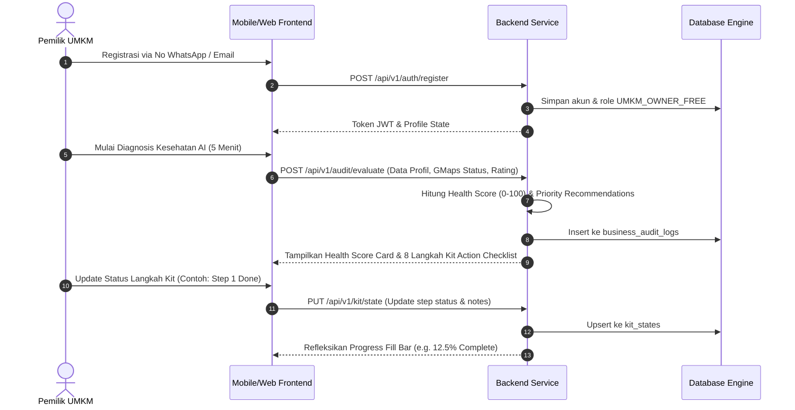
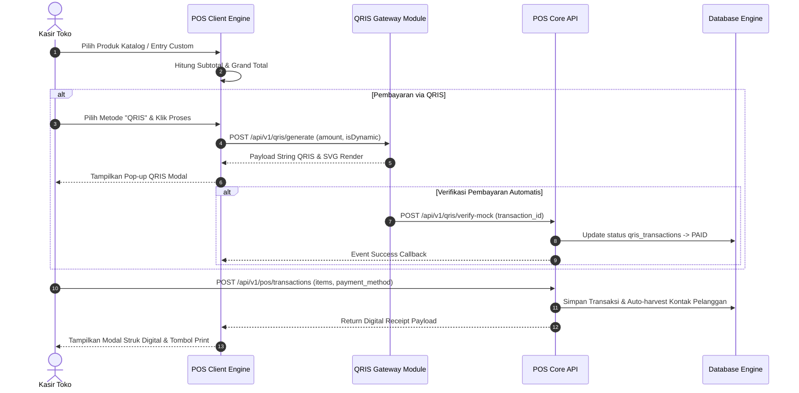
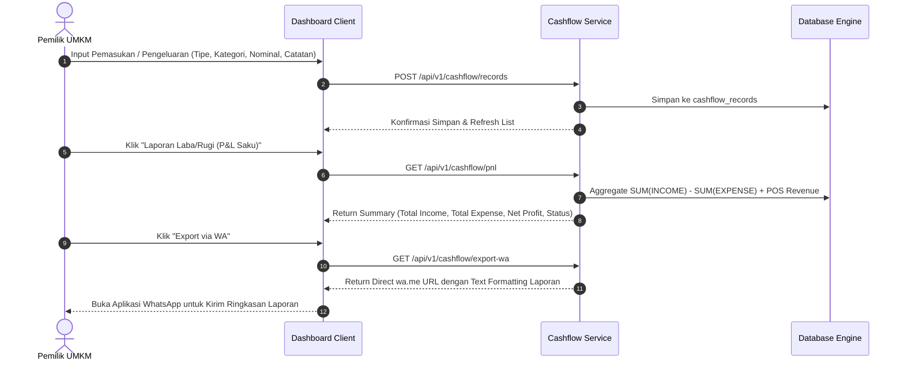
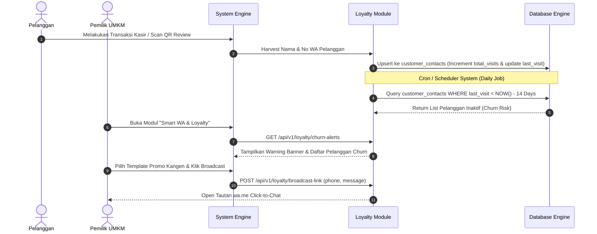
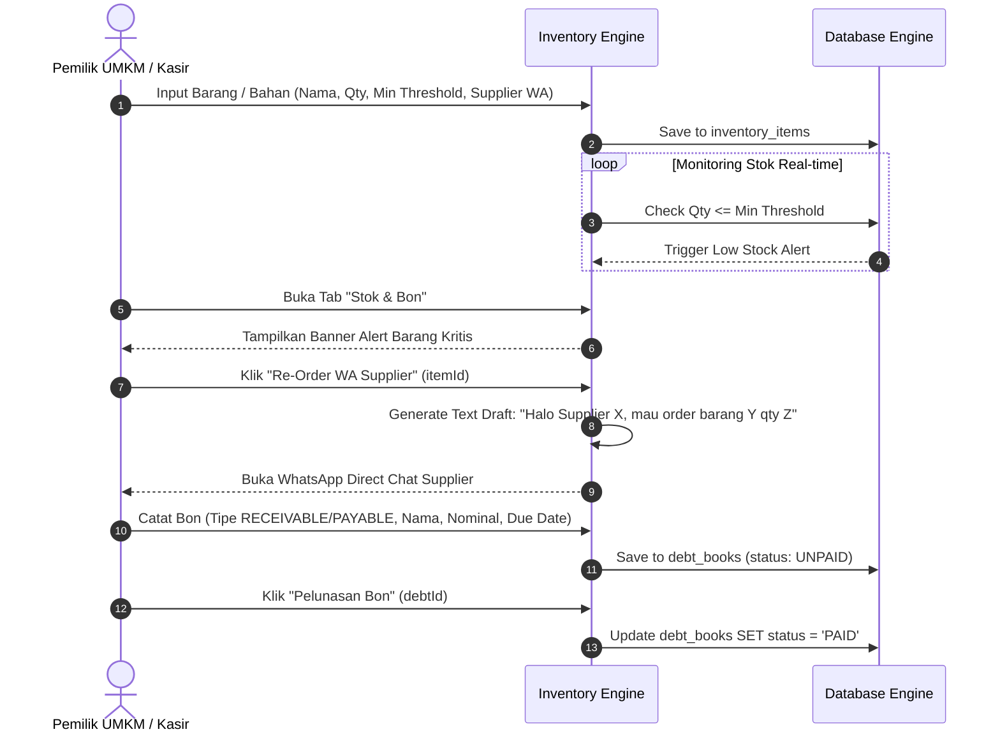
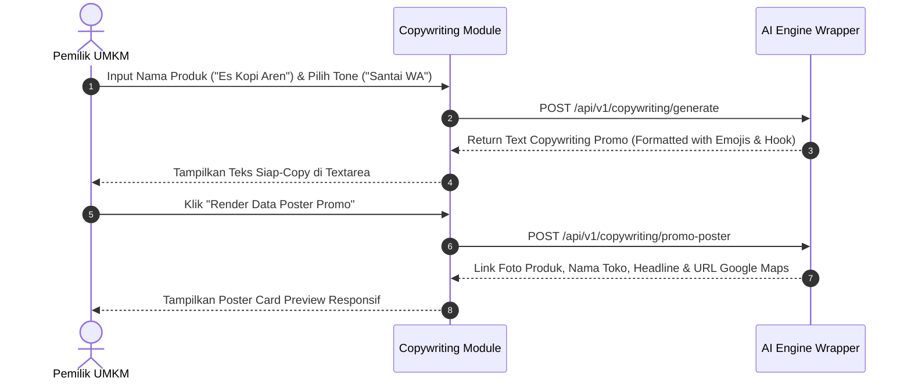
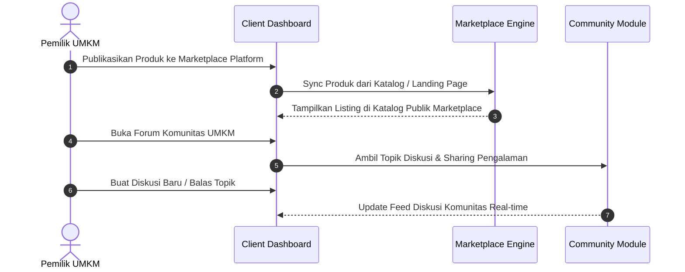
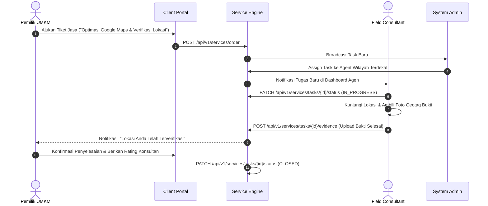
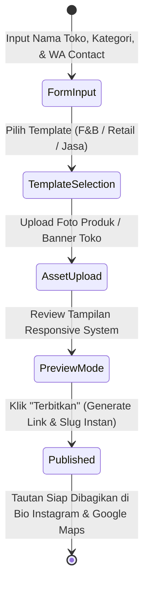

# Software Requirements & Specification: SuperUMKM Platform

Platform pendampingan, konsultasi, dan operasional digital terpadu untuk UMKM segmen Menengah-Bawah Indonesia (Diagnosis AI & Kit Lokal Naik Kelas, Google Maps Optimization, Mini Catalog Web Builder, POS Instant & QRIS, Pembukuan P&L Saku, Smart WA Loyalty Engine, Stok & Buku Bon, AI Promo Generator, Marketplace & Komunitas UMKM).

---

## 1. User Roles & Permission Matrix (RBAC)

Sistem menggunakan model *Role-Based Access Control* (RBAC) dengan 5 entitas pengguna utama:

| Fitur / Modul | UMKM Owner (Free) | UMKM Owner (Premium) | Cashier (Anak Buah) | Consultant / Field Agent | Super Admin |
| :--- | :---: | :---: | :---: | :---: | :---: |
| **Self-Audit & Action Kit** | Read / Execute | Read / Execute | No Access | Read All | Read All / Manage |
| **Google Maps & QR Review** | Standard PDF | Custom Branded PDF | Read / Print | Assist Setup | Manage Templates |
| **Landing Page / Web Builder** | 1 Page Builder | Multi-section + WA Hook | Read Catalog | Assist Setup | Full Manage |
| **POS Instant & Transaksi** | Full Access | Full Access | Transaction Entry | View Reports | Full Access |
| **Staff Assignment (Kasir)** | **Max 1 Staf** | **Unlimited Staf** | No Access | No Access | Full Manage |
| **Cashflow & P&L Saku** | Read / Create | Read / Create / Export | Create Entry | View Summary | Full Access |
| **Smart WA Broadcast & Loyalty**| Basic Contacts | Full Churn Alert & WA | View Contacts | Assist Broadcast | Full Access |
| **Stok, Bon & Supplier Order** | Low Stock Alert | Unlimited Re-Order | Record Bon | View Stock | Full Access |
| **AI Promo & Poster Generator**| Standard Tone | Priority AI & Poster | No Access | Assist Copywriting| Full Access |
| **Integrasi QRIS Kasir** | Static QRIS | Dynamic QRIS + Auto Verify| Generate & Scan | Assist Setup | Full Access |
| **Marketplace & Komunitas** | View & Post Basic | Priority Listing & Forum | View Only | Moderation Assist | Full Manage |
| **Field Service (Pin Maps)** | View Status | View Status + Report | No Access | Update Geotag | Full Oversight |
| **Video Micro-Tutorials** | Basic Tier | All Tiers (Premium) | Read Basic | Read All | Manage / Upload |

---

## 2. Core User Flows (System Interactions)

### 2.1. Onboarding, Automated Business Health Check & Kit "Lokal Naik Kelas" Flow
Pemilik UMKM mendaftar, menjawab audit kesehatan digital (5 menit), serta menjalankan 8 langkah eksekusi etalase digital.



---

### 2.2. POS Transaction, QRIS Auto-Verification & Digital Receipt Flow
Kasir atau pemilik toko menginput produk ke keranjang, memilih metode bayar QRIS dinamis, menyimulasi verifikasi pembayaran otomatis, dan mencetak struk digital.



---

### 2.3. Cashflow & P&L Saku Recording & WhatsApp Export Flow
Pencatatan harian pemasukan/pengeluaran dengan kategori UMKM, penghitungan omzet bersih otomatis, dan ekspor laporan ringkas via WhatsApp.



---

### 2.4. Smart WhatsApp Loyalty, Contact Harvesting & Churn Alert Flow
Himpunan kontak pelanggan dari transaksi kasir & ulasan QR, deteksi pelanggan inaktif (>14 hari), dan pengiriman broadcast promo `wa.me`.



---

### 2.5. Inventory Monitoring, Low Stock Trigger, Supplier WA Order & Buku Bon Flow
Monitoring stok barang/bahan baku, peringatan otomatis saat menyentuh batas minimum, draft re-order WA supplier, serta pencatatan bon utang-piutang.



---

### 2.6. AI Copywriting & Promo Poster Data Linker Flow
Penataan kalimat promosi kontekstual lokal berbasis tone dan rendering poster visual produk yang menautkan foto, toko, dan Google Maps.



---

### 2.7. Marketplace & Komunitas UMKM Engagement Flow
Pemilik UMKM mengunggah katalog produk ke marketplace lokal dan berpartisipasi dalam forum komunitas antar pengusaha.



---

### 2.8. Field Service Request & Task Execution Flow
Permintaan pendampingan verifikasi etalase & lokasi oleh Agen Wilayah.



---

### 2.9. Landing Page & Catalog Publishing State Flow


---

## 3. Database Entity Relationship Diagram (ERD)

```mermaid
erDiagram
    USERS ||--o{ BUSINESS_PROFILES : owns
    USERS ||--o{ AUDIT_LOGS : takes
    USERS ||--o{ KIT_STATES : manages
    USERS ||--o{ SERVICE_REQUESTS : orders
    USERS ||--o{ POS_TRANSACTIONS : creates
    USERS ||--o{ CASHFLOW_RECORDS : logs
    USERS ||--o{ CUSTOMER_CONTACTS : collects
    USERS ||--o{ INVENTORY_ITEMS : manages
    USERS ||--o{ DEBT_BOOKS : records
    USERS ||--o{ QRIS_TRANSACTIONS : generates

    USERS {
        uuid id PK
        varchar phone_number UK
        varchar full_name
        varchar role_code
        varchar status
        timestamp created_at
    }

    BUSINESS_PROFILES {
        uuid id PK
        uuid user_id FK
        varchar business_name
        varchar category
        text address_text
        decimal latitude
        decimal longitude
        varchar gmaps_url
        varchar landing_page_slug UK
        timestamp updated_at
    }

    AUDIT_LOGS {
        uuid id PK
        uuid user_id FK
        uuid business_id FK
        integer health_score
        jsonb audit_answers
        jsonb recommendations
        timestamp created_at
    }

    KIT_STATES {
        uuid id PK
        uuid owner_id FK
        jsonb step_statuses
        jsonb step_fields
        jsonb maintenance_checklist
        timestamp updated_at
    }

    POS_TRANSACTIONS {
        uuid id PK
        uuid owner_id FK
        uuid cashier_id FK
        jsonb items_array
        decimal grand_total
        varchar payment_method
        varchar receipt_code
        timestamp created_at
    }

    CASHFLOW_RECORDS {
        uuid id PK
        uuid owner_id FK
        varchar type
        varchar category
        decimal amount
        text notes
        date date
        timestamp created_at
    }

    CUSTOMER_CONTACTS {
        uuid id PK
        uuid owner_id FK
        varchar name
        varchar phone UK
        varchar source
        integer total_visits
        date last_visit
        timestamp created_at
    }

    INVENTORY_ITEMS {
        uuid id PK
        uuid owner_id FK
        varchar item_name
        integer quantity
        integer min_threshold
        varchar supplier_name
        varchar supplier_phone
        timestamp updated_at
    }

    DEBT_BOOKS {
        uuid id PK
        uuid owner_id FK
        varchar type
        varchar person_name
        decimal amount
        date due_date
        varchar recorded_by
        varchar status
        timestamp created_at
    }

    QRIS_TRANSACTIONS {
        uuid id PK
        uuid owner_id FK
        varchar transaction_id UK
        decimal amount
        text qris_payload
        varchar status
        timestamp created_at
    }

    SERVICE_REQUESTS {
        uuid id PK
        uuid client_id FK
        varchar service_type
        varchar current_status
        text requirement_notes
        timestamp created_at
    }

    TUTORIAL_CONTENTS {
        uuid id PK
        varchar title
        varchar module_category
        text video_url
        integer duration_seconds
        varchar minimum_tier
        boolean is_active
    }
```



---

## 4. Modular Codebase Architecture Map

```text
├── docs/
│   ├── ARCHITECTURE.md       # Architectural overview & Stack
│   ├── MIGRATIONS.md          # PostgreSQL SQL DDL Scripts
│   ├── MODULES_API.md          # Complete REST API specification
│   ├── RBAC_MATRIX.md          # Comprehensive role permission table
│   └── USER_FLOWS.md          # Core sequence & state diagrams
├── src/
│   ├── modules/
│   │   ├── audit/             # Business Health Check AI Engine
│   │   ├── auth/              # JWT Auth & RBAC Middleware Guards
│   │   ├── cashflow/          # Cashflow & P&L Saku Controller
│   │   ├── copywriting/       # AI Promo Generator & Poster Data Linker
│   │   ├── gmaps/             # Review QR Generator & Auto-Reply AI
│   │   ├── inventory/         # Stock Alerts, Supplier Orders & Buku Bon
│   │   ├── kit/               # Unified Kit "Lokal Naik Kelas" Engine
│   │   ├── landing/           # Static Web Builder & WA Hook
│   │   ├── learning/          # Video Micro-Course Module
│   │   ├── loyalty/           # Smart WA Broadcast & Churn Alerts
│   │   ├── pos/               # POS Instant & Staff Management
│   │   ├── qris/              # QRIS Generator & Mock Auto-Verifier
│   │   └── services/          # Ticketing & Field Agent Smart Route
│   └── shared/
│       ├── database/          # In-Memory DB Persistence Layer & Seeds
│       └── utils/             # RBAC Guards & JWT Utilities
├── public/                    # Client Dashboard & Landing Pages
│   ├── app.js                 # Frontend Interactive Engine
│   ├── home.html              # Marketing Landing Page Utama
│   ├── index.html             # Main Portal Dashboard App
│   └── styles.css             # Glassmorphism Design System
├── test/                      # Node Test Suite (25 Tests Pass 100%)
└── USER_FLOW_SPEC.md          # Software Requirements & Specification
```
