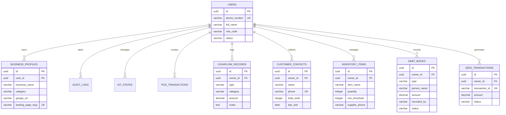

# SuperUMKM Platform - System Architecture Specification

## 1. Platform Vision & Operating System Lifecycle (CHECK → FIX → GROW)
Platform SuperUMKM beralih dari "kumpulan tools terpisah" menjadi **"AI Business Consultant / Operating System Pendamping Usaha"** berbasis siklus operasional:
1. **CHECK**: Deterministic Health Score Engine (`src/modules/audit/`) mengevaluasi 8 dimensi kesehatan etalase digital (0-100 poin) secara transparan melalui Progressive Audit Wizard 4-langkah.
2. **FIX**: Action Center Dashboard merekomendasikan **"Fokus Minggu Ini"** (Max 3 task teratas dengan dampak poin tertinggi, e.g. `+15 Poin`) yang terhubung langsung ke modul eksekusi terkait (**Mini Website & Toko Online Instan**, **Google Maps & Standee QR**, **POS & QRIS Kasir**, **Pembukuan P&L**, **Video Micro-Course**, **Tiket Konsultan Lapangan**).
3. **GROW**: Modul Kit "Lokal Naik Kelas", tracker maintenance mingguan, dan pendampingan lapangan berkelanjutan.

```
 ┌────────────────────────────────────────────────────────────────────────┐
 │                           Client Layer                                 │
 │  ┌───────────────────┐  ┌───────────────────┐  ┌────────────────────┐ │
 │  │ UMKM Owner Portal │  │ Field Agent Mobile│  │ Super Admin Portal │ │
 │  └─────────┬─────────┘  └─────────┬─────────┘  └─────────┬──────────┘ │
 └────────────┼──────────────────────┼──────────────────────┼────────────┘
              │                      │                      │
 ┌────────────▼──────────────────────▼──────────────────────▼────────────┐
 │                            API Gateway / Express Router               │
 │  ┌─────────────────────────────────────────────────────────────────┐  │
 │  │ JWT & Hak Akses Staf Middleware Guard (Free, Premium, Agent)   │  │
 │  └─────────────────────────────────────────────────────────────────┘  │
 └────────────┬─────────────────────────────────────────────┬────────────┘
              │                                             │
 ┌────────────▼─────────────────────────────────────────────▼────────────┐
 │                CHECK → FIX → GROW Core Engine                         │
 │  ┌──────────────┐ ┌──────────────┐ ┌──────────────┐ ┌──────────────┐  │
 │  │ Audit Engine │ │ Action Center│ │ GMaps Engine │ │ Instan Toko  │  │
 │  └──────────────┘ └──────────────┘ └──────────────┘ └──────────────┘  │
 │  ┌──────────────┐ ┌──────────────┐ ┌──────────────┐ ┌──────────────┐  │
 │  │  POS Kasir   │ │ Cashflow Mod │ │ Loyalty WA   │ │Inventory Mod │  │
 │  └──────────────┘ └──────────────┘ └──────────────┘ └──────────────┘  │
 │  ┌──────────────┐ ┌──────────────┐ ┌──────────────┐ ┌──────────────┐  │
 │  │ AI Promo Mod │ │  QRIS Mod    │ │ Services Mod │ │ Learning Mod │  │
 │  └──────────────┘ └──────────────┘ └──────────────┘ └──────────────┘  │
 └────────────┬─────────────────────────────────────────────┬────────────┘
              │                                             │
 ┌────────────▼─────────────────────────────────────────────▼────────────┐
 │                           Persistence Layer                           │
 │ ┌───────────────────────────────────────────────────────────────────┐ │
 │ │ PostgreSQL Database / In-Memory Shared Data Store (`db.js`)       │ │
 │ └───────────────────────────────────────────────────────────────────┘ │
 └───────────────────────────────────────────────────────────────────────┘
```

## 2. Technology Stack & Routing Strategy
- **Runtime & Language**: Node.js (v18+), ES6+ JavaScript
- **Web & API Framework**: Express.js REST API Architecture
- **Clean Store Routing**: Public store URLs use clean slug routes `/toko/:slug` (mapped to `public/landing.html`) instead of query parameters.
- **Frontend Layer**: Modern HTML5, Custom Vanilla CSS (Glassmorphism & Action Center Cards), Vanilla JS Async Engine
- **Database Engine**: PostgreSQL Schema (DDL SQL compatibility) / Shared Persistence Layer (`db.js`)
- **Authentication & Security**: JWT (JSON Web Tokens) with granular Role & Tier Guards
- **Testing Framework**: Native `node --test` runner (30 tests passing 100%)

## 3. Deterministic Health Score Engine Architecture
Diagnosis kesehatan usaha menggunakan rule-engine deterministik 100 poin (bukan prompt AI acak):
- **Google Business Presence**: 20%
- **Review & Reputasi Toko**: 15%
- **Foto & Kelengkapan Visual**: 10%
- **Mini Website & Toko Online Instan**: 15%
- **WhatsApp & Kontak Toko**: 10%
- **Produk & Kesiapan Harga**: 10%
- **Transaksi Digital & QRIS**: 10%
- **Kesiapan Operasional Toko**: 10%

Response API audit menyertakan transparansi 8 dimensi:
```json
{
  "health_score": 75,
  "status_grade": "PERLU OPTIMALISASI LOKAL",
  "breakdown": [
    { "dimension": "Google Business Presence", "earned": 20, "max": 20, "gap_reason": "Lokasi toko sudah terdaftar dan terverifikasi di Google Maps." },
    { "dimension": "Mini Website & Toko Online Instan", "earned": 0, "max": 15, "gap_reason": "Belum menerbitkan Mini Website & Toko Online Instan." }
  ],
  "top_focus_tasks": [
    { "title": "📱 Buat Mini Website & Toko Online Instan", "impact_points": 15, "action_tab_id": "landing-tab" }
  ]
}
```

## 4. UI Copywriting & Terminology Standards
Seluruh istilah developer teknis disanitasi dari antarmuka pengguna:
- **`RBAC`** → `Hak Akses Staf` / `Akses Pengguna`
- **`AI Model Analysis`** → `Analisis Kesehatan Usaha AI`
- **`Smart Route Dispatcher`** → `Pusat Rute Pendampingan Agen`
- **`CRITICAL`** → `Perlu Perhatian Khusus`
- **`Anak Buah`** → `Staf Kasir` / `Staf Toko`
- **`Builder Website Sementara`** → `Mini Website & Toko Online Instan`

## 5. Database Entity ERD


## 6. Module Registry Overview
- `audit` - Deterministic scoring engine (0-100 poin, breakdown 8 dimensi & Action Center task resolution)
- `auth` - Otentikasi JWT & Middleware Hak Akses Staf
- `cashflow` - Catatan harian pemasukan/pengeluaran & P&L Saku
- `copywriting` - AI Copywriting promosi harian & Poster Data Linker
- `gmaps` - Standee QR Review Generator, Balasan ulasan AI, Kupon loyalitas
- `inventory` - Stok Kritis Alert, Draft Order Supplier WA, & Buku Bon
- `kit` - Engine Kit "Lokal Naik Kelas" 8 langkah eksekusi & tracker mingguan
- `landing` - Pembuat Mini Website & Toko Online Instan (`/toko/:slug`)
- `learning` - Micro-course video edukasi berjenjang
- `loyalty` - Broadcast WA, customer contact harvester, & Churn alert
- `pos` - POS Kasir instant, cetak struk digital & kelola staf kasir toko
- `qris` - Payload QRIS dinamis/statis & Mock auto-verifier
- `services` - Field Service Ticket Assignment & Pusat Rute Pendampingan Agen
- `docs` - System Admin exclusive documentation hub (Matriks Hak Akses Staf, REST Registry, DDL SQL)
- `users` - Dynamic role-based navigation menu resolver
