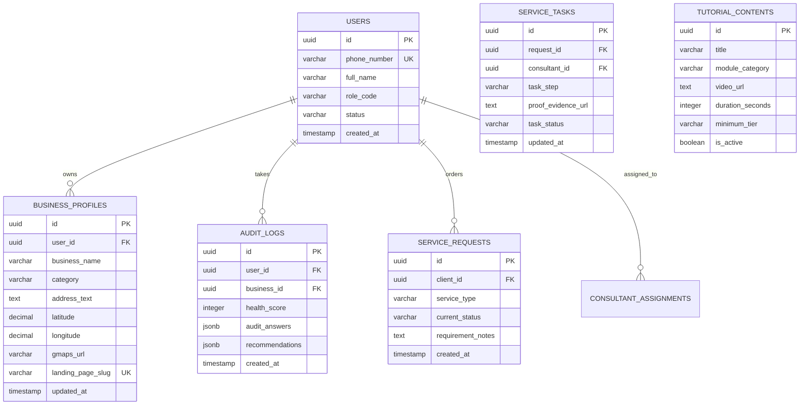

# Business Consultant UMKM Platform - System Architecture Specification

## 1. System Overview
Platform pendampingan dan konsultasi digital UMKM segmen Menengah-Bawah (Google Maps Optimization, Review Management, Landing Page Builder, dan Video Edukasi Mandiri).

```
 ┌────────────────────────────────────────────────────────────────────────┐
 │                           Client Layer                                 │
 │  ┌───────────────────┐  ┌───────────────────┐  ┌────────────────────┐ │
 │  │ UMKM Owner Portal │  │ Field Agent Mobile│  │ Super Admin Portal │ │
 │  └─────────┬─────────┘  └─────────┬─────────┘  └─────────┬──────────┘ │
 └────────────┼──────────────────────┼──────────────────────┼────────────┘
              │                      │                      │
 ┌────────────▼──────────────────────▼──────────────────────▼────────────┐
 │                            API Gateway / Express Router               │
 │  ┌─────────────────────────────────────────────────────────────────┐  │
 │  │ JWT & RBAC Middleware Guard (Free, Premium, Agent, Admin)      │  │
 │  └─────────────────────────────────────────────────────────────────┘  │
 └────────────┬─────────────────────────────────────────────┬────────────┘
              │                                             │
 ┌────────────▼─────────────────────────────────────────────▼────────────┐
 │                          Core Modules Engine                          │
 │  ┌──────────────┐ ┌──────────────┐ ┌──────────────┐ ┌──────────────┐  │
 │  │ Auth Module  │ │ Audit Module │ │ GMaps Module │ │Landing Module│  │
 │  └──────────────┘ └──────────────┘ └──────────────┘ └──────────────┘  │
 │  ┌───────────────────────────────┐ ┌───────────────────────────────┐  │
 │  │      Learning Module          │ │       Services Module         │  │
 │  └───────────────────────────────┘ └───────────────────────────────┘  │
 └────────────┬─────────────────────────────────────────────┬────────────┘
              │                                             │
 ┌────────────▼─────────────────────────────────────────────▼────────────┐
 │                           Persistence Layer                           │
 │ ┌───────────────────────────────────────────────────────────────────┐ │
 │ │ PostgreSQL / SQLite Database (Users, Profiles, Audit, Tasks, etc) │ │
 │ └───────────────────────────────────────────────────────────────────┘ │
 └───────────────────────────────────────────────────────────────────────┘
```

## 2. Technology Stack
- **Runtime & Language**: Node.js, JavaScript (ES6+) / TypeScript
- **Web & API Framework**: Express.js REST API
- **Frontend Layer**: HTML5, Modern Vanilla CSS (Glassmorphism & Responsive System), Client-side JS
- **Database Engine**: PostgreSQL compatible schema (Knex / SQLite / In-Memory persistence)
- **Authentication**: JWT (JSON Web Tokens) with RBAC Middleware

## 3. Database Schema (Entity Relationship Diagram)


## 4. REST API Endpoint Registry

### Auth Module (`/api/v1/auth`)
- `POST /api/v1/auth/register` - User Registration (UMKM Owner, Field Agent, Admin)
- `POST /api/v1/auth/login` - Authenticate & obtain JWT
- `GET /api/v1/auth/me` - Get Current User Profile & RBAC Role

### Audit Module (`/api/v1/audit`)
- `POST /api/v1/audit/evaluate` - Execute Business Health Check (Calculate score 0-100 & action checklist)
- `GET /api/v1/audit/history` - Retrieve audit history for user business

### GMaps & QR Review Module (`/api/v1/gmaps`)
- `POST /api/v1/gmaps/qr-generate` - Generate QR Review template config
- `GET /api/v1/gmaps/checklist` - Get Google Maps optimization checklist

### Landing Page Builder (`/api/v1/landing`)
- `POST /api/v1/landing/create` - Build landing page / catalog slug
- `GET /api/v1/landing/:slug` - Public access for published catalog & WhatsApp hook

### Learning & Micro-Courses (`/api/v1/learning`)
- `GET /api/v1/learning/courses` - Fetch video tutorials filtered by user tier (Basic vs Premium)
- `POST /api/v1/learning/courses` - Upload/Manage tutorial (Admin only)

### Services & Ticketing (`/api/v1/services`)
- `POST /api/v1/services/order` - Request field service (Maps verification, QR printing, etc)
- `GET /api/v1/services/tasks` - List tasks (Filtered by role: Client vs Field Agent vs Admin)
- `PATCH /api/v1/services/tasks/:id/assign` - Assign field consultant (Admin only)
- `POST /api/v1/services/tasks/:id/evidence` - Upload geotagged completion proof (Agent only)
- `PATCH /api/v1/services/tasks/:id/status` - Update lifecycle status (IN_PROGRESS, COMPLETED, CLOSED)
