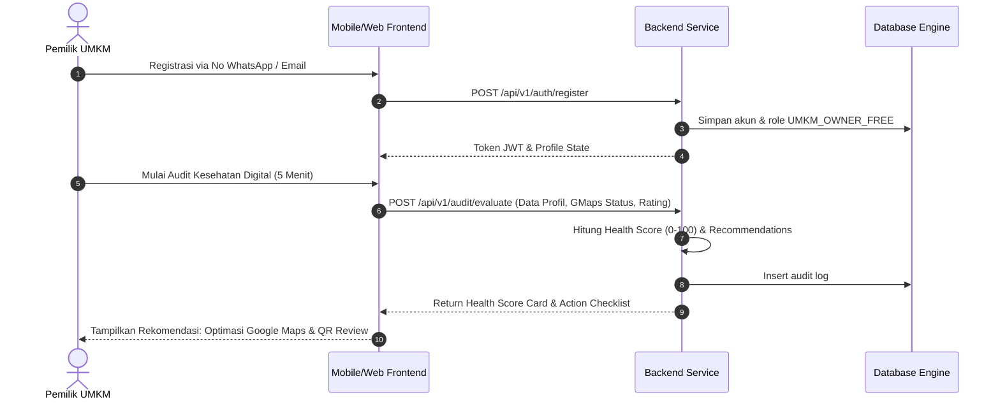
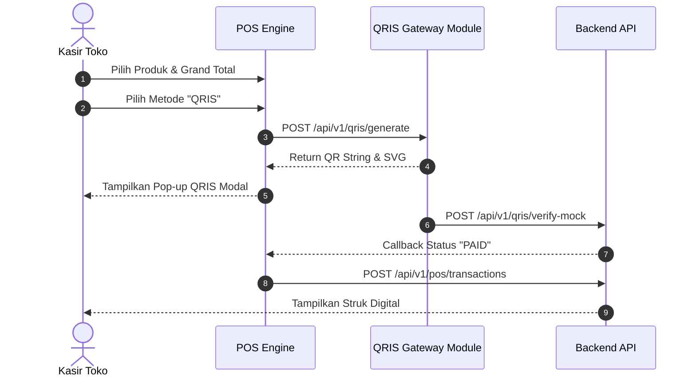
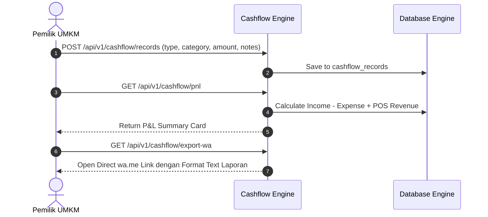
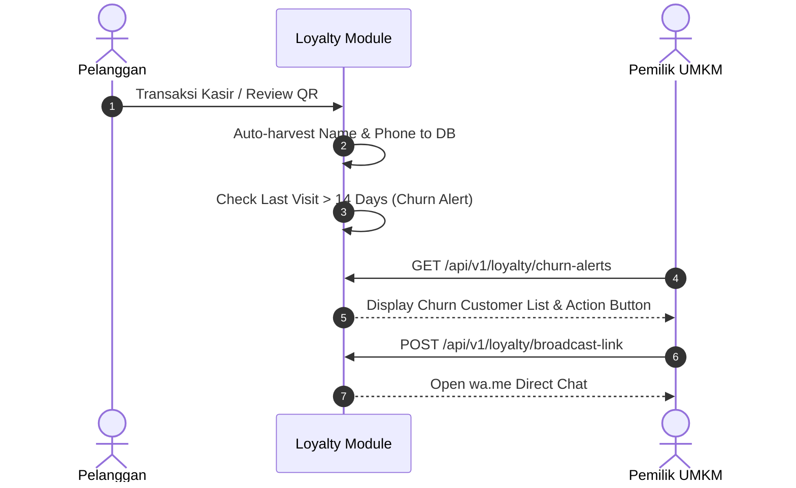
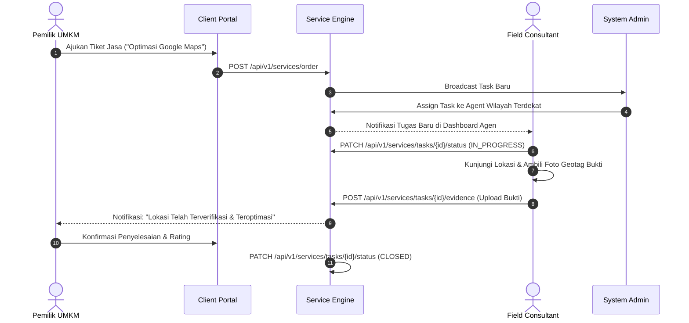
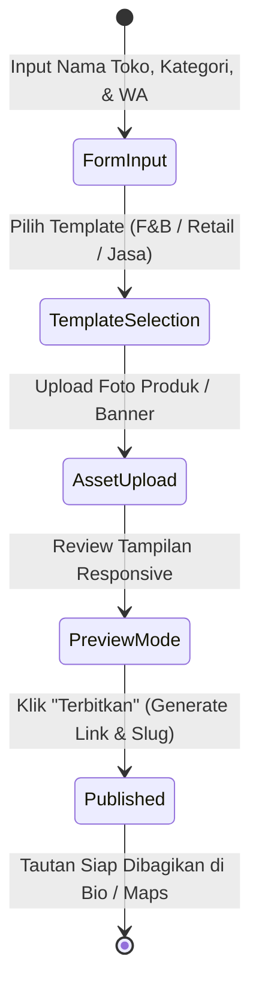

# Core User Flows Specification

## 1. Onboarding & Business Health Check + Kit Flow
Pemilik UMKM melakukan registrasi, pengisian audit 5 menit, dan mendapatkan Health Score serta Kit "Lokal Naik Kelas" Action Plan.

## 2. POS Transaction & QRIS Auto-Verification Flow
Kasir memasukkan produk ke keranjang, memilih bayar QRIS dinamis, dan sistem menyimulasi verifikasi pembayaran instan.

## 3. Cashflow & P&L Saku Recording & WhatsApp Export Flow
Pencatatan harian pemasukan/pengeluaran dengan kategori UMKM, omzet bersih otomatis, dan 1-klik export laporan WA.

## 4. Smart WA Loyalty & Churn Alert Flow
Himpunan kontak otomatis dari transaksi kasir & ulasan QR, deteksi pelanggan inaktif (>14 hari), dan pengiriman broadcast promo `wa.me`.

## 5. Field Service Request & Task Execution Flow
Pemilik UMKM mengajukan permintaan pendampingan lapangan. Task dialokasikan Admin ke Agen Wilayah dengan bukti foto geotag.

## 6. Landing Page & Catalog Publishing State Flow

