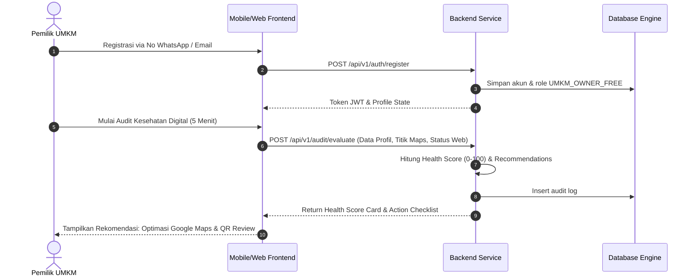
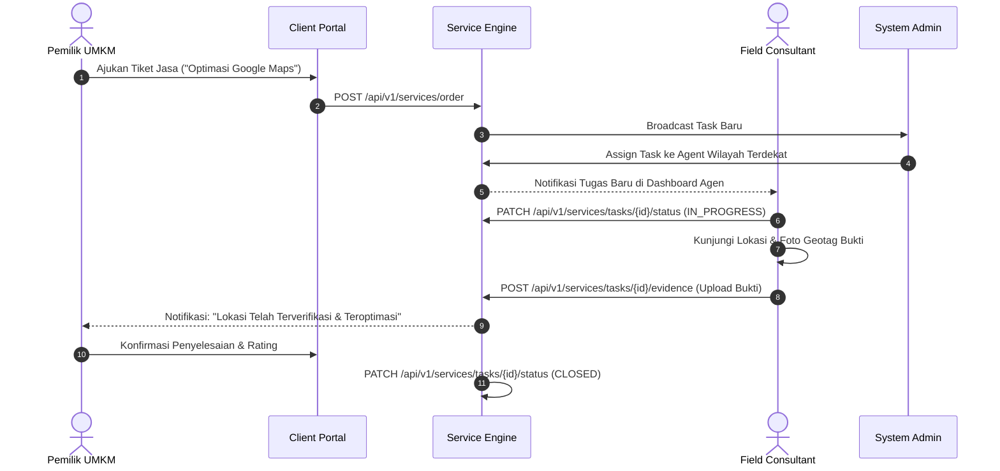
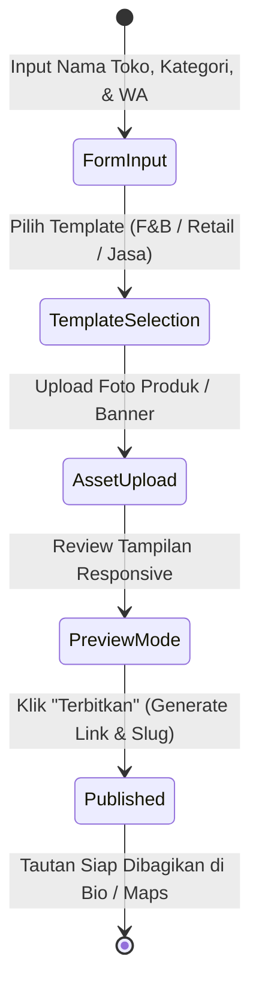

# Core User Flows Specification

## 1. Onboarding & Business Health Check Flow
Pemilik UMKM melakukan registrasi, pengisian audit 5 menit, dan mendapatkan Health Score serta Action Plan.

## 2. Field Service Request & Task Execution Flow
Pemilik UMKM mengajukan permintaan pendampingan lapangan (misal verifikasi lokasi / cetak QR). Task dialokasikan Admin ke Agen Wilayah.

## 3. Landing Page & Catalog Publishing State Flow

