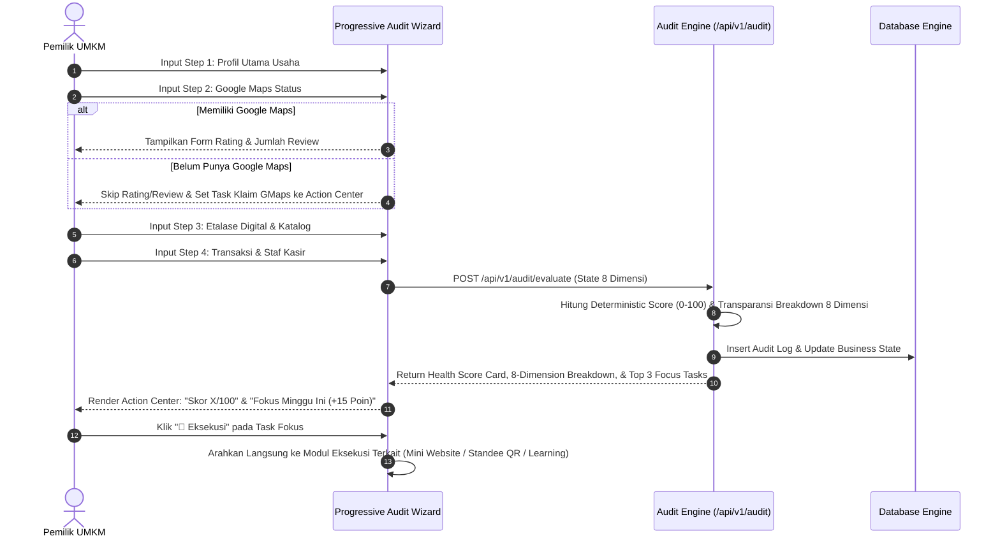
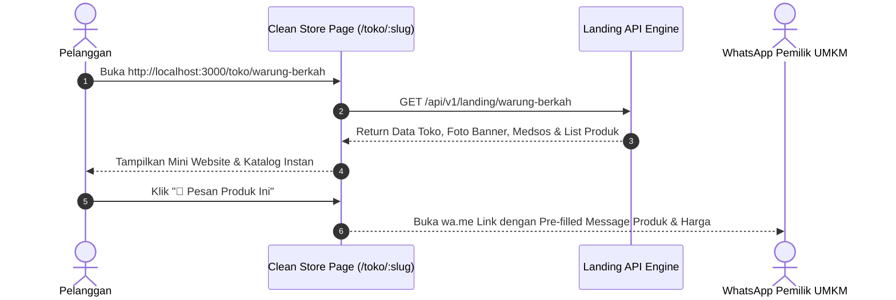
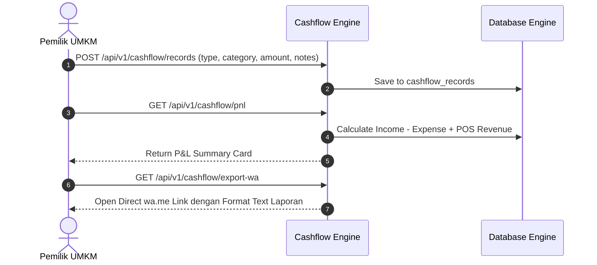
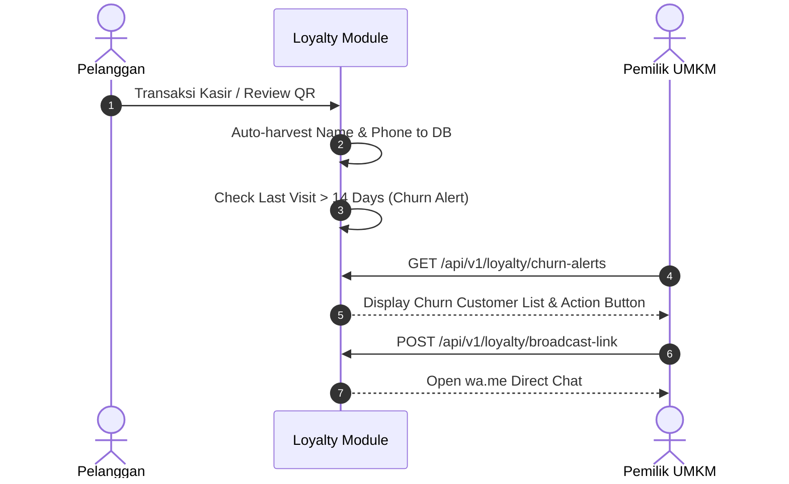
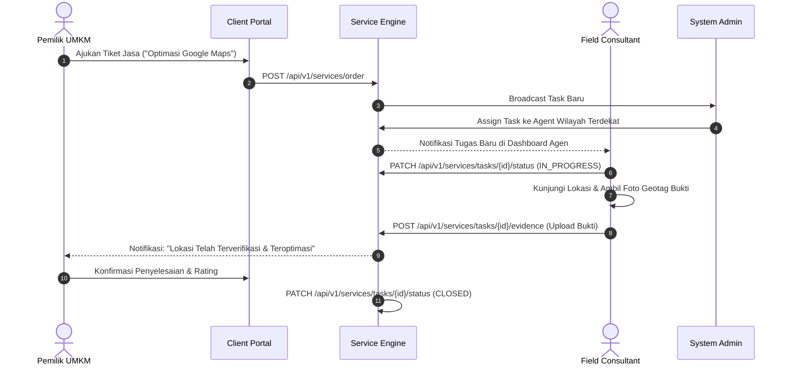

# Core User Flows Specification

## 1. Progressive Onboarding Audit Wizard & Action Center Flow
Pemilik UMKM melakukan pengisian audit 4-langkah (Profil Usaha → Google Maps → Digital Presence & Katalog → Transaksi & Operasional) dengan conditional branching (melewati rating/review jika belum punya Maps), dan menerima Health Score deterministik (0-100 poin), transparansi 8 dimensi, serta **Action Center: Fokus Minggu Ini** (Top 3 prioritas dengan dampak poin tertinggi).

## 2. Customer Public Store Flow (`/toko/:slug`)
Pelanggan mengakses tautan toko instan UMKM via clean URL `/toko/:slug`, melihat katalog produk, dan melakukan pemesanan langsung via WhatsApp.

## 3. POS Transaction & QRIS Auto-Verification Flow
Staf Kasir Toko memasukkan produk ke keranjang, memilih bayar QRIS dinamis, dan sistem menyimulasi verifikasi pembayaran instan.

## 4. Cashflow & P&L Saku Recording & WhatsApp Export Flow
Pencatatan harian pemasukan/pengeluaran dengan kategori UMKM, omzet bersih otomatis, dan 1-klik export laporan WA.

## 5. Smart WA Loyalty & Churn Alert Flow
Himpunan kontak otomatis dari transaksi kasir & ulasan QR, deteksi pelanggan inaktif (>14 hari), dan pengiriman broadcast promo `wa.me`.

## 6. Field Service Request & Task Execution Flow
Pemilik UMKM mengajukan permintaan pendampingan lapangan. Task dialokasikan Admin ke Agen Wilayah dengan bukti foto geotag.

